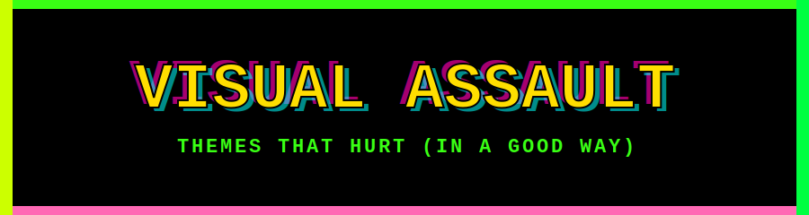

Your app looks fine. That's the problem.

Visual Assault is a library of loud, deliberately eye-searing color themes —
neon, clashing, borderline-illegal-looking palettes for whatever you're
building. Still readable. Just aggressively not calm. A few of these are
honestly kind of good-looking — we're not proud of that, but none of them
are boring.

## Questions, Answered Poorly

**Which framework is this for?**
Yes. CSS, Tailwind, React, Tkinter, Qt, whatever cursed stack you're
running — if your AI assistant has heard of it, we probably work with it.
Probably.

**Why does this exist?**
AI-induced psychosis.

**How do I install it?**
No package to install. No SDK, no CLI, nothing to `npm install`. We vibe
coded it and now you can vibe install it. You just tell your AI coding
assistant which theme you want, and it builds the file for your framework.

**Who is this "we" we keep talking about?**
Claude. It's Claude. There is no "we."

## Quick Start

Copy this into your AI coding assistant (Claude Code, Cursor, Copilot Chat,
whatever) from inside your app's repo, and swap in a theme name from the
list below:

```
Fetch https://raw.githubusercontent.com/gerp93/VisualAssault/main/themes/THEMES.md
and apply the "<theme name>" theme to this app. Detect this app's styling
mechanism (CSS, Tailwind, a JS theme object, Tkinter, etc.) and produce one
native theme file using that mechanism, transcribing the theme's color
values exactly. Do not rewire existing components to use it unless I ask
separately.
```

Can't fetch URLs? Open `themes/THEMES.md`, copy the one theme's section you
want, and paste it in instead. Either way, that's it — you now have an
unreasonably loud theme file.

## Pick your poison (14 themes)

Swatches below are background / primary action / accent, in that order —
just a taste, not the full palette.

| Theme | Vibe | Colors |
|---|---|---|
| Blue Oval | Deep blue, high-contrast |    |
| Bubblegum | Hot pink explosion |    |
| Commander Keen | Retro DOS EGA/VGA palette |    |
| Electric Lime | Bright green-yellow blast |    |
| Flambeau | Warm orange and ember tones |    |
| Flambeau Inverse | Inverse of Flambeau |    |
| Green Acres | Farm-green and yellow |    |
| Hacker | Matrix-style green on black |    |
| Hawkeye | Black and old-gold |    |
| Lava | Fiery red-hot |    |
| Merica | Red/white/blue |    |
| Neon | High-contrast neon dark mode |    |
| Red Barn | Barn red with bright accents |    |
| Retrowave | 80s synthwave palette |    |

Full color values for every theme live in [`themes/THEMES.md`](themes/THEMES.md).

## Okay fine, real packages too

For four frameworks we actually bothered to own — **CSS**, **Tkinter**,
**Flet**, and **Angular** (yes, that includes Angular apps wrapped in
Electron/Tauri as a desktop app) — there are real, install-the-normal-way
packages, deterministically built from `themes/THEMES.md`, no AI required
at the point you use them:
[`packages/css`](packages/css), [`packages/tkinter`](packages/tkinter),
[`packages/flet`](packages/flet), [`packages/angular`](packages/angular).

For anything else, it's still the vibe install up top.

## The fine print

These themes stay readable — good contrast is non-negotiable. The "assault"
part is the colors themselves, not broken legibility. We're not trying to
make your app unusable, just deeply unpleasant to look at (in a good way).

We dont know (or care) how this actually works under the hood. But
if you want to find out (or force an enslaved GPU to explain it to you), the machines were kind enough to write it all down:
[`docs/HOW_IT_WORKS.md`](docs/HOW_IT_WORKS.md).
